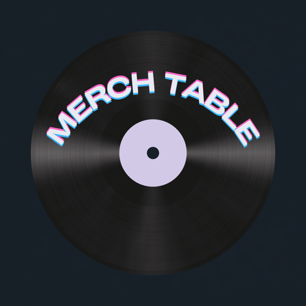

Local-first app for tracking merch table sales at shows. No backend, no accounts — everything lives in IndexedDB on the device and works fully offline. Ships as a PWA (Cloudflare Pages) and as native iOS/Android apps (Capacitor) from the same React codebase — no separate native rewrite.

## How it works

- **Stock tab** — set up at home on wifi: items, prices, variants (sizes), starting counts.
- **Sell tab** — two taps per sale: tap the item button, tap Cash or Card/Venmo. Long-press an item for a price override (door deals, bundles). Undo button refunds the last sale.
- **Night tab** — end-of-night summary: units per item, cash vs digital totals, remaining inventory, cash-box reconciliation with discrepancy flag, CSV export, and "Start new night".

## Data model

Every sale is an immutable event (`sale` or `refund`) in an append-only log. Inventory and totals are derived by folding over the log — undo is just appending a refund event, and future multi-device sync becomes append-only log merge.

## Develop

```sh
npm install
npm run dev
```

## Test

TDD project — new behavior starts with a failing test.

```sh
npm test          # full suite once
npm run test:watch
```

Seams under test (tests live at these public boundaries only):

- `src/db.test.ts` — event-log module: sale/refund append semantics, derived stock and totals, night sessions, uuid/device stamps
- `src/migration.test.ts` — v1→v2 schema backfill
- `src/csv.test.ts` — export column contract and escaping
- `src/screens/SellScreen.test.tsx` — taps in, visible totals/readout out: two- and three-tap sales, double-tap debounce, one-tap undo, advisory stock, price override
- `src/screens/NightScreen.test.tsx` — reconcile math (float + cash = expected drawer), night boundary, negative-stock flags

UI tests assert through the rendered screen, never by reading the database — that's the seam.

## Build + deploy

```sh
npm run build
```

`dist/` is fully static — drop it on Cloudflare Pages, Vercel, or any static host. The service worker precaches everything, so after the first visit the app loads with no connection. Install to the home screen from the browser share menu. Live at merch-table.pages.dev.

Real QA environment: airplane mode.

## Native apps (iOS / Android)

Same React app, wrapped with [Capacitor](https://capacitorjs.com) — `src/native.ts` gates all native-only behavior (status bar, splash screen, haptics) behind `Capacitor.isNativePlatform()`, so the web build is untouched. Bundle ID: `com.htpdevs.merchtable`.

```sh
npm run ios:open       # builds web assets, syncs, opens Xcode
npm run android:open   # builds web assets, syncs, opens Android Studio
npm run cap:sync       # just rebuild + sync, no IDE
```

After editing any source under `src/`, you must `cap:sync` (or use one of the `:open` scripts) before the native apps see the change — they run against the built `dist/`, copied into `ios/App/App/public` and `android/app/src/main/assets/public`, not against the dev server.

**iOS** requires the full Xcode app (not just Command Line Tools) to build, sign, or run in the simulator — CocoaPods is not used, Capacitor 8 resolves plugins via Swift Package Manager automatically the first time you open the project in Xcode (needs network access once).

**Android** builds from the CLI with just the Android SDK + a Java 17–21 JDK — Android Studio's bundled JBR works if your system default JDK is newer (Gradle doesn't support very new JDKs yet):

```sh
JAVA_HOME="/Applications/Android Studio.app/Contents/jbr/Contents/Home" cd android && ./gradlew assembleDebug
```

**Regenerating icons/splash screens**: source art lives in `assets/icon.png` (1024×1024) and `assets/splash.png` (2732×2732, plain upscale of the logo — no padding, since splash screens get device-fit/cropped automatically, unlike the maskable PWA icon which needs a strict safe zone). Run `npm run assets:generate` after replacing either file; it regenerates every density for both platforms plus the PWA icon set (the PWA icon set it emits to `icons/` is unused — this project's web icons are hand-tuned in `public/`, wired in `vite.config.ts`, and shouldn't be overwritten by this command's `icons/` output).

**Known gap**: the Android hardware back button uses Capacitor's default (exits the app — correct at the root screen, since this is a single-page tab app with no navigation stack) but does not close open modals (Stock item editor, price override, onboarding, etc.) — it exits instead. Fixing that needs centralized modal-open state across those components; not done yet.
